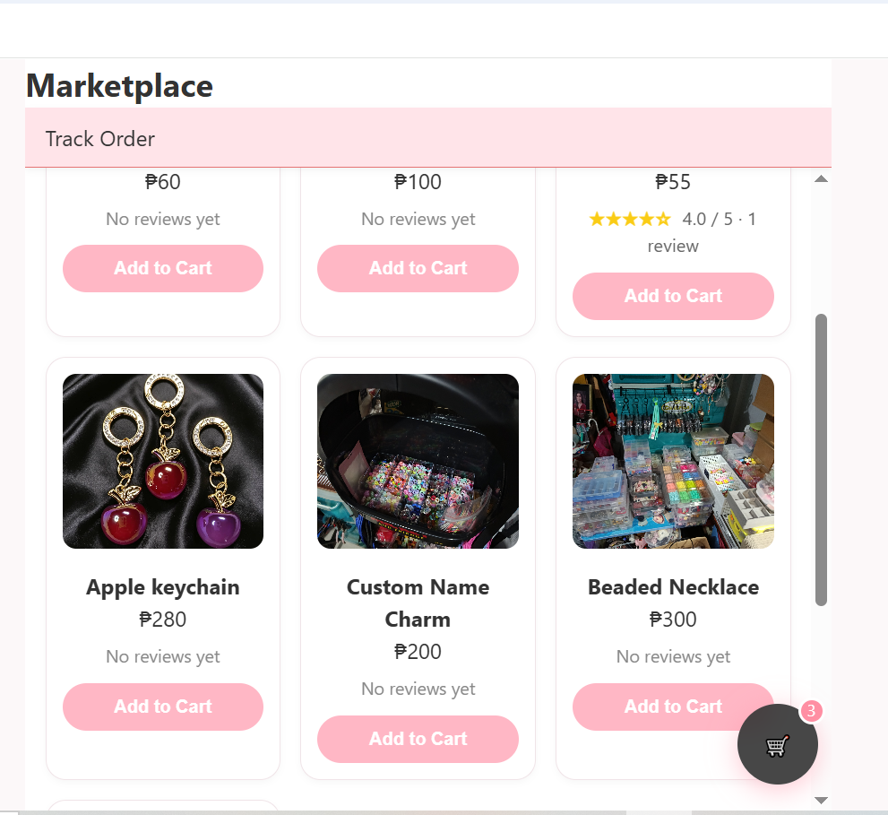
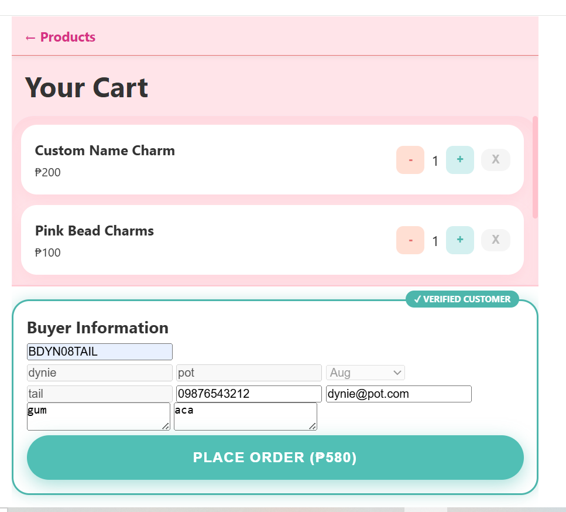
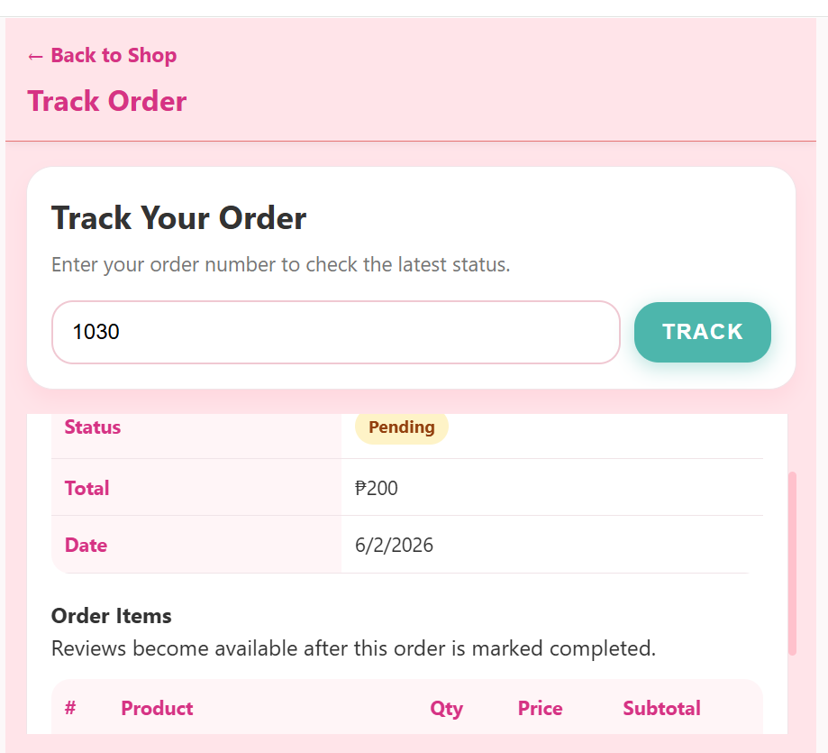
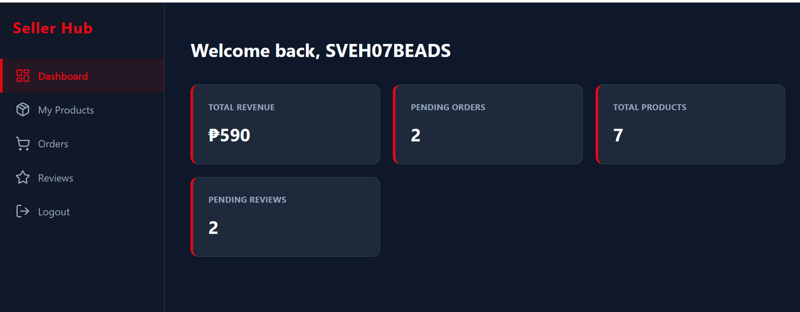
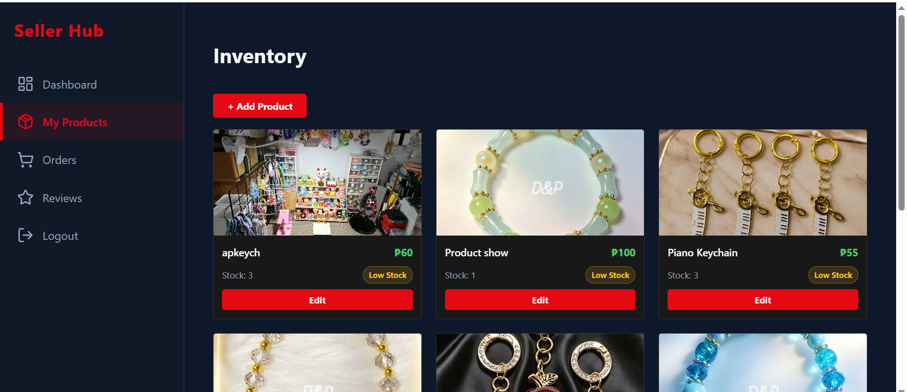
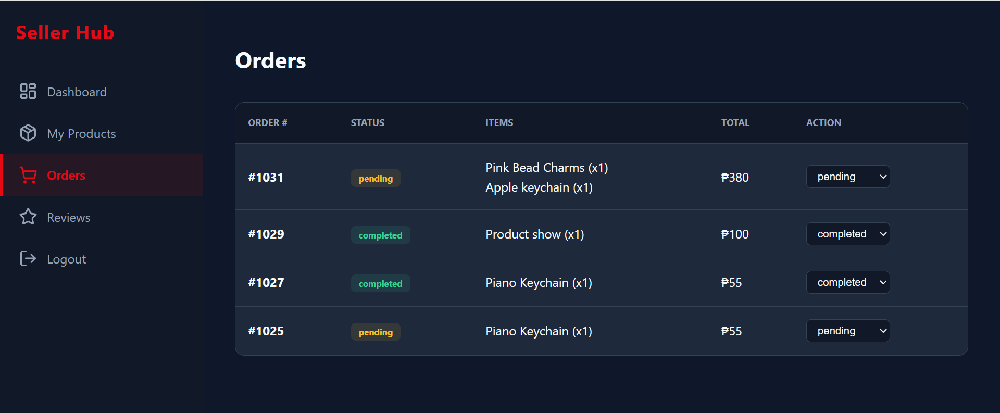
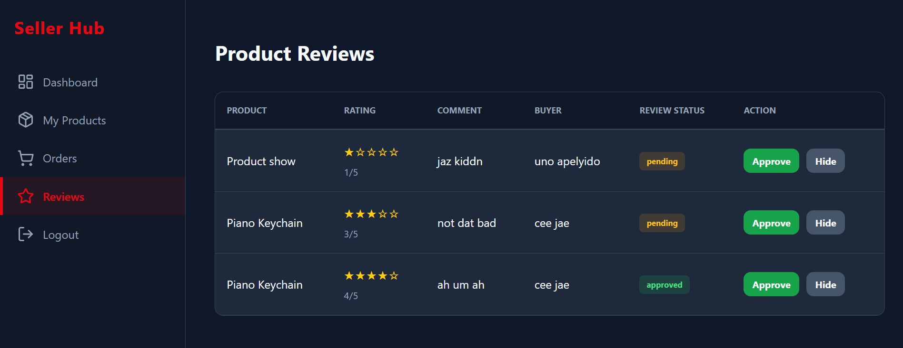
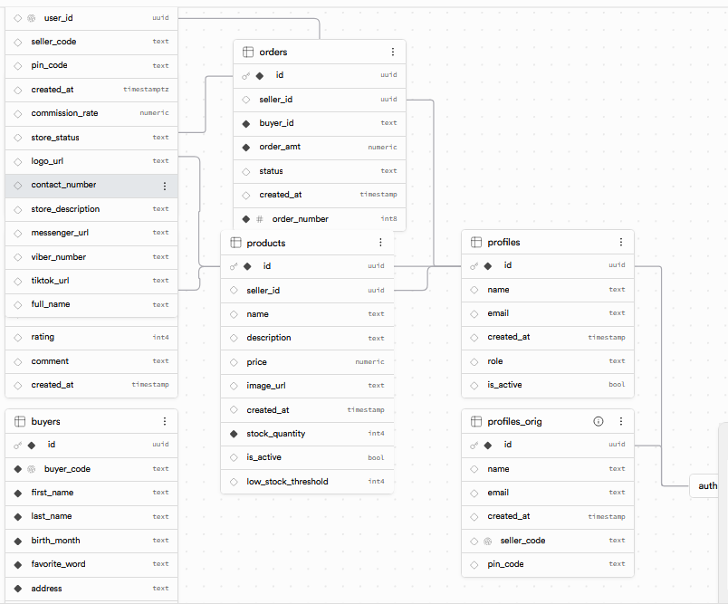
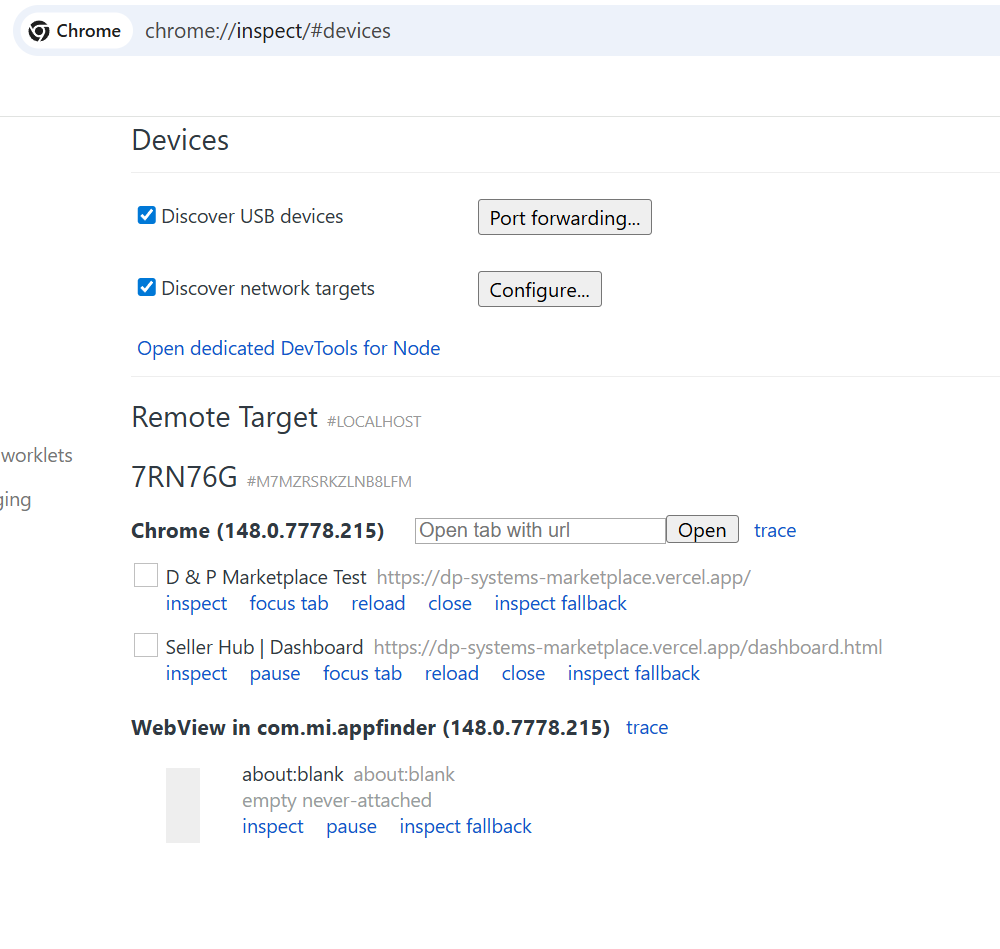

# Multi-Seller Marketplace Prototype

A working **Supabase-backed multi-seller marketplace prototype** built with **HTML, CSS, vanilla JavaScript, ES modules, PostgreSQL, Supabase Auth, Supabase Storage, RLS policies, and PostgreSQL RPC checkout logic**.

This project was built as a portfolio case study for a **Supabase Backend & DevOps Developer with full-stack implementation skills**. It demonstrates buyer checkout, seller dashboard workflows, inventory safety, order tracking, review moderation, and real-device mobile QA.

---

## Live Links

- **Portfolio:** https://dp-systems-portfolio.vercel.app/
- **Marketplace Demo:** https://dp-systems-marketplace.vercel.app/
- **Case Study:** https://dp-systems-portfolio.vercel.app/marketplace-case-study.html

---

## Project Status

**Status:** Working prototype / portfolio case study  
**Current focus:** final cleanup, deployment, screenshots, and business outreach  
**Feature state:** core marketplace functionality is working; larger production modules are planned for future versions.

Completed core flows:

- Buyer product browsing
- Add to cart
- Cart quantity updates
- Guest checkout
- Buyer code lookup
- Multi-seller order splitting
- Stock validation
- PostgreSQL RPC checkout transaction
- Seller login and onboarding
- Seller dashboard
- Product CRUD
- Order status management
- Public order tracking
- Buyer reviews
- Seller review moderation
- Approved review display on products
- Real Android mobile testing
- Android Back / browser history behavior fixes

---

## Key Selling Points

- Supabase-backed multi-seller marketplace prototype
- Guest buyer checkout without full buyer login
- Multi-seller cart splitting into seller-specific orders
- PostgreSQL RPC checkout transaction for safer stock/order handling
- Seller login and onboarding with Supabase Auth
- Seller dashboard for products, orders, and reviews
- Product CRUD with image handling and stock management
- Order tracking by order number
- Buyer reviews with seller moderation
- Approved reviews displayed publicly
- Real Android device QA
- Chrome DevTools remote debugging through `chrome://inspect`
- Android Back navigation/history fixes with `pushState` / `popstate`
- Mobile landscape scroll, keyboard, and cart FAB fixes
- Contact-link QA: Call/Text, Messenger, TikTok passed; Viber hidden pending reliable format

---

## Tech Stack

### Frontend

- HTML5
- CSS3
- Vanilla JavaScript
- ES modules
- Vite for local development

### Backend

- Supabase Cloud
- Supabase Auth
- Supabase Database
- Supabase Storage
- PostgreSQL
- PostgreSQL RPC transactions
- Row Level Security policies

### Deployment and Workflow

- GitHub
- Vercel
- Chrome DevTools
- Android remote debugging via `chrome://inspect`

---

## Main Features

## 1. Buyer Marketplace

Buyers can browse products, add items to cart, and check out without creating a full account.

Buyer-side features include:

- Product listing
- Product pricing and stock display
- Add-to-cart behavior
- Cart persistence
- Quantity controls
- Stock-aware cart behavior
- Guest buyer information form
- Buyer code lookup
- Checkout validation
- Order tracking by order number
- Approved product reviews

---

## 2. Multi-Seller Checkout

The cart supports products from multiple sellers.

During checkout, the system groups cart items by seller and creates separate seller-specific orders.

Example:

- One cart contains products from Seller A and Seller B.
- Checkout creates one order for Seller A and another order for Seller B.
- Each seller only sees their own orders in the dashboard.

This demonstrates marketplace business logic beyond a basic single-seller cart.

---

## 3. Inventory Safety

The project includes multiple stock safety layers.

### Layer 1: Add-to-cart validation

- Checks whether the product is active.
- Checks current stock.
- Prevents the buyer from adding more than available stock.

### Layer 2: Cart revalidation

Before checkout, the local cart is synchronized against current Supabase product data.

This handles:

- inactive products
- missing products
- changed prices
- changed product names/images
- reduced stock
- seller ID consistency

### Layer 3: Database-side checkout transaction

The final checkout step uses a **PostgreSQL RPC transaction** to create orders, insert order items, deduct stock, and prevent unsafe partial order creation.

This helps reduce overselling risk when stock is limited.

---

## 4. Seller Dashboard

Authenticated sellers can manage their store through a dedicated dashboard.

Seller dashboard features include:

- Revenue summary
- Pending orders
- Total active products
- Pending reviews indicator
- Product add/edit/delete
- Product image handling
- Product stock management
- Order status updates
- Review approval/hiding

The dashboard uses a seller identity model where `sellers.id` is treated as the true seller record for products and orders.

---

## 5. Order Tracking

Buyers can track their order using an order number.

The tracking page displays:

- Order status
- Ordered items
- Order total
- Seller contact options
- Review form for completed orders

Order status changes made by the seller are visible to the buyer through the tracking page.

---

## 6. Reviews and Moderation

Buyers can leave product reviews after an order is completed.

Review flow:

1. Buyer tracks a completed order.
2. Buyer submits a rating and comment.
3. Review is saved as `pending`.
4. Seller reviews it in the dashboard.
5. Seller can approve or hide it.
6. Approved reviews display publicly on the product page.

Implemented review protections:

- Reviews are tied to order/product context.
- Duplicate reviews are blocked.
- Pending reviews do not display publicly.
- Hidden reviews do not display publicly.
- Approved reviews display on the marketplace page.

---

## 7. Mobile QA and Real-Device Testing

This project was tested on a real Android phone instead of relying only on desktop browser resizing.

Mobile QA included:

- Android Chrome portrait testing
- Android Chrome landscape testing
- checkout flow testing
- order tracking testing
- review form testing
- seller dashboard testing
- keyboard behavior testing
- floating cart button fixes
- scroll behavior fixes
- contact/deep-link testing
- Android Back button behavior

Remote debugging used:

```text
chrome://inspect
```

The Android device was connected through USB debugging so live mobile tabs could be inspected from desktop Chrome DevTools.

This exposed real mobile app behavior issues that ordinary responsive layout testing does not catch.

---

## 8. Android Back / Browser History Fixes

The project includes browser-history handling for mobile app-like flows.

Problems fixed:

- checkout success returning to stale cart page
- track page looping back to marketplace repeatedly
- empty cart looping back to marketplace repeatedly
- seller dashboard Orders/Reviews exiting to Chrome on Android Back

Key techniques used:

- `window.location.replace()` for completed or exit-style flows
- `history.pushState()` for internal dashboard sections
- `popstate` handling for Seller Hub views
- controlled navigation from dynamic empty-cart and track-page buttons

Expected Seller Hub behavior:

```text
Stats → Products → Orders → Reviews
Back → Orders
Back → Products
Back → Stats
Back → normal browser/app exit
```

---

## 9. Contact Link QA

Seller contact buttons were tested on a real device.

Current results:

| Contact option | Status         |
| -------------- | -------------- |
| Call / Text    | Working        |
| Messenger      | Working        |
| TikTok         | Working        |
| Viber          | Hidden for now |

Viber is still captured during onboarding and stored in the database, but the buyer-facing Viber button is hidden because direct Viber deep links were unreliable on the test device and desktop app.

---

## Backend Design

The backend uses Supabase with relational tables for:

- `profiles`
- `sellers`
- `products`
- `buyers`
- `orders`
- `order_items`
- `reviews`

### Seller Identity Model

The final seller identity model uses the `sellers` table as the true seller record.

Relationship flow:

```text
auth.users.id
→ profiles.id
→ sellers.user_id
→ sellers.id
```

Important rules:

- `products.seller_id` uses `sellers.id`
- `orders.seller_id` uses `sellers.id`
- dashboard queries use `currentSellerId = sellers.id`
- auth user ID is used only to look up the seller record

This fixed earlier dashboard consistency bugs where products/orders showed zero because different queries used different seller identity sources.

---

## Key Backend Lessons

This project focused heavily on backend correctness and workflow behavior, including:

- seller identity consistency
- auth-to-profile-to-seller mapping
- multi-seller order grouping
- stock validation
- RPC transaction design
- RLS policy debugging
- review moderation security
- guest checkout behavior
- order status syncing
- dashboard query consistency

---

## Screenshots

### Marketplace Home



### Cart and Checkout



### Order Tracking



### Seller Dashboard



### Product Management



### Seller Orders



### Review Moderation



### Supabase Backend



### Real Android Remote Debugging



---

## What This Project Demonstrates

This project demonstrates practical skills in:

- Supabase backend development
- PostgreSQL table design
- RPC transaction design
- Row Level Security planning and debugging
- Supabase Auth integration
- authenticated seller workflows
- guest buyer checkout
- multi-seller marketplace logic
- inventory safety
- product CRUD
- order tracking
- review moderation
- vanilla JavaScript app structure
- real-device mobile QA
- Chrome DevTools remote debugging
- Android Back/browser history handling
- GitHub/Vercel deployment workflow
- portfolio-ready full-stack implementation

---

## My Role

Built as a **Supabase Backend & DevOps Developer portfolio project** with full-stack implementation using HTML, CSS, vanilla JavaScript, and a real Supabase backend.

Focus areas:

- Supabase backend setup
- database table design
- seller identity model
- RLS policy debugging
- product and order workflows
- checkout transaction logic
- seller dashboard behavior
- mobile QA and debugging
- deployment and documentation

---

## Current Limitations

This is a working portfolio prototype, not a full production e-commerce platform.

Current limitations:

- no payment gateway yet
- no cancellation/refund workflow yet
- no full admin panel yet
- iOS Safari QA is planned but not yet completed
- Viber direct-chat link is hidden pending a reliable deep-link format
- contact form/backend notification workflow can be improved later

---

## Planned Improvements

Future enhancements may include:

- order cancellation workflow
- payment and refund integration
- iOS Safari compatibility pass
- mobile card layout for order tracking
- direct camera capture for product images
- admin dashboard
- notifications for order status changes
- Google Maps pickup/meetup location support
- Viber compatibility review

---

## Development Notes

Recommended cleanup before final deployment:

- remove temporary debug logs
- remove debug alerts
- keep useful `console.error` logs
- keep Viber compatibility comment
- lightly clean duplicate CSS only after regression testing
- avoid adding new features before final deploy

Final regression checklist:

- buyer marketplace
- cart with items
- empty cart
- checkout
- order tracking
- review submission
- seller review approval/hide
- approved review display
- seller dashboard sections
- Android Back behavior
- desktop browser Back behavior
- mobile portrait
- mobile landscape

---

## Security Notes

Do not commit any Supabase service-role key.

A public Supabase anon key may appear in browser-based frontend code, but service-role keys and private credentials must remain outside the public repository.

---

## License / Usage

This project is a portfolio prototype by **D & P Systems**.

You may use the repository as a demonstration of Supabase-backed marketplace workflows, dashboard implementation, and real-device mobile QA.
